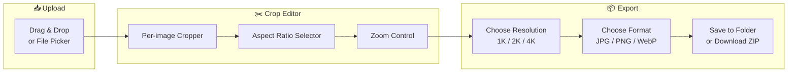

# 🖼️ BatchCrop

> **Batch Image Cropping Tool** — Upload multiple images, crop them all with the same aspect ratio, and export in resolutions up to 4K.

[](https://react.dev)
[](https://typescriptlang.org)
[](https://vite.dev)
[](https://tailwindcss.com)
[](LICENSE)

<!-- Screenshot: run `npm run dev` and capture the UI -->
<!--  -->

---

## ✨ Features

- **📂 Batch upload** — Drag & drop or file picker for multiple images at once
- **✂️ Aspect ratio presets** — 1:1, 16:9, 4:3, 9:16, 3:4, or free crop
- **📐 Resolution scaling** — Export at 1K (1024px), 2K (2048px), or 4K (4096px)
- **🎨 Format selection** — Save as JPEG, PNG, or WebP
- **💾 Dual export** — Save directly to a folder (File System Access API) or download as ZIP
- **💨 100% client-side** — Zero API calls, zero backend, zero data leaves your browser

---

## 🚀 Quick Start

**Prerequisites:** [Node.js](https://nodejs.org) 18+

```bash
git clone https://github.com/vandre-sales/batch-image-crop.git
cd batch-image-crop
npm install
npm run dev
```

Open **[http://localhost:3000](http://localhost:3000)** in your browser.

---

## 📐 How It Works



### Workflow in 4 Steps

| Step | Action | Result |
|:---:|---|---|
| **1** | **Upload** images (drag & drop or click) | Image grid with individual croppers |
| **2** | **Adjust** crop area, zoom, and aspect ratio | Live preview per image |
| **3** | **Configure** resolution (1K/2K/4K) and format (JPG/PNG/WebP) | Settings applied globally |
| **4** | Click **Save to Folder** or **Download ZIP** | Cropped images exported |

---

## 💾 Export Options

| Method | Browser Support | How It Works |
|---|---|---|
| **Save to Folder** | Chrome, Edge (File System Access API) | Pick a directory → images saved directly |
| **Download ZIP** | All browsers (fallback) | JSZip bundles all cropped images → ZIP download |

---

## 🖥️ Export Resolutions

| Quality | Longest Side | Best For |
|:---:|:---:|---|
| **1K** | 1024 px | Social media, thumbnails |
| **2K** | 2048 px | Web, presentations, e-commerce |
| **4K** | 4096 px | Print, high-res marketing assets |

The longest side of each cropped image is scaled to the selected resolution. Aspect ratio is preserved.

---

## 🏗️ Tech Stack

| Technology | Version | Purpose |
|---|:---:|---|
| [**React**](https://react.dev) | 19 | UI framework with hooks |
| [**TypeScript**](https://typescriptlang.org) | 5.8 | Type safety |
| [**Vite**](https://vite.dev) | 6 | Build tool with HMR |
| [**Tailwind CSS**](https://tailwindcss.com) | 4 | Utility-first styling |
| [**react-easy-crop**](https://github.com/ricardo-ch/react-easy-crop) | 5 | Image cropping component |
| [**react-dropzone**](https://react-dropzone.js.org) | 15 | Drag & drop file upload |
| [**JSZip**](https://stuk.github.io/jszip/) | 3 | Client-side ZIP generation |
| [**file-saver**](https://github.com/eligrey/FileSaver.js) | 2 | Browser file download |
| [**Lucide React**](https://lucide.dev) | — | Icon library |

---

## 📁 Project Structure

```
batch-image-crop/
├── index.html          # Entry point
├── package.json        # Dependencies & scripts
├── vite.config.ts      # Vite + Tailwind + React config
├── tsconfig.json       # TypeScript config
├── LICENSE             # MIT
├── README.md           # This file
└── src/
    ├── main.tsx        # React DOM entry
    ├── App.tsx         # Main app — upload, crop grid, settings, export
    └── index.css       # Tailwind imports
```

---

## 📦 Scripts

| Command | Description |
|---|---|
| `npm run dev` | Start dev server on port 3000 |
| `npm run build` | Build for production (`dist/`) |
| `npm run preview` | Preview production build |
| `npm run lint` | TypeScript type checking |
| `npm run clean` | Remove `dist/` folder |

---

## 🤝 Contributing

Contributions are welcome! Feel free to open issues or submit PRs.

1. Fork the repository
2. Create your feature branch (`git checkout -b feature/amazing-feature`)
3. Commit your changes (`git commit -m 'feat: add amazing feature'`)
4. Push to the branch (`git push origin feature/amazing-feature`)
5. Open a Pull Request

---

## 📄 License

[MIT](LICENSE) — **[Vandre Sales](https://github.com/vandre-sales)** 2026

---

<div align="center">

**Built with** ❤️ **using React, Vite & Tailwind CSS**

[⬆ Back to top](#-batchcrop)

</div>
